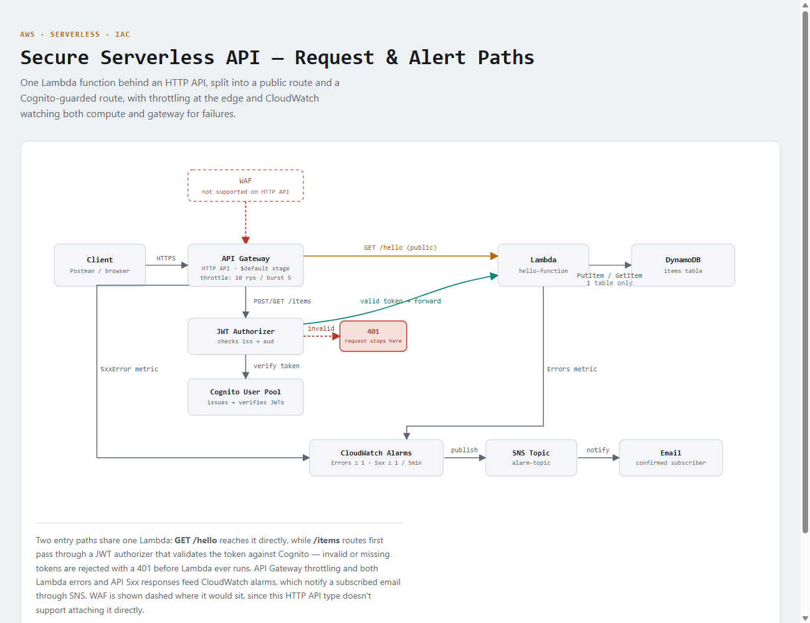
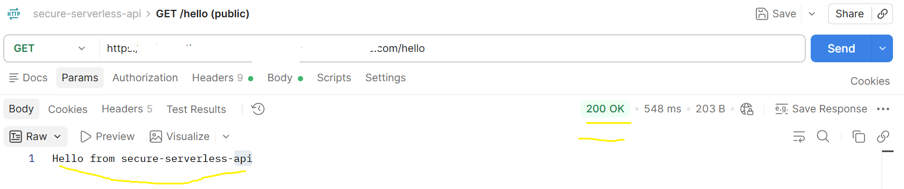
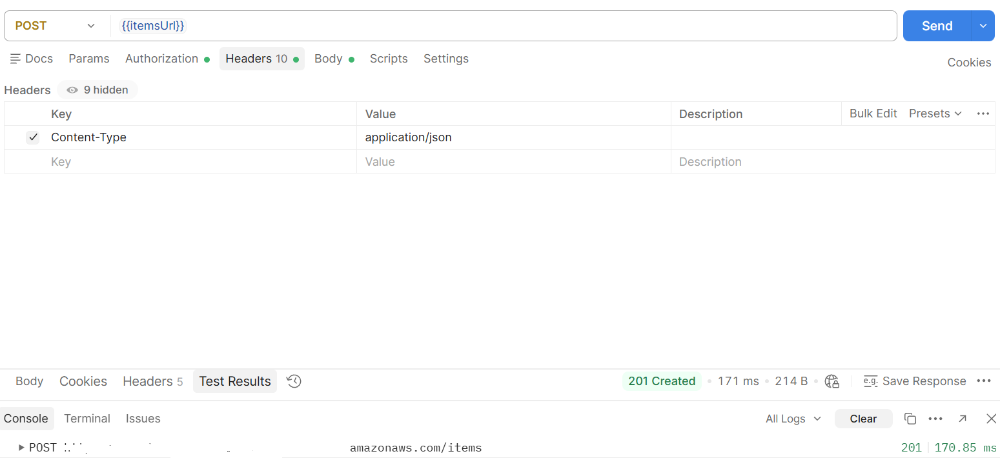
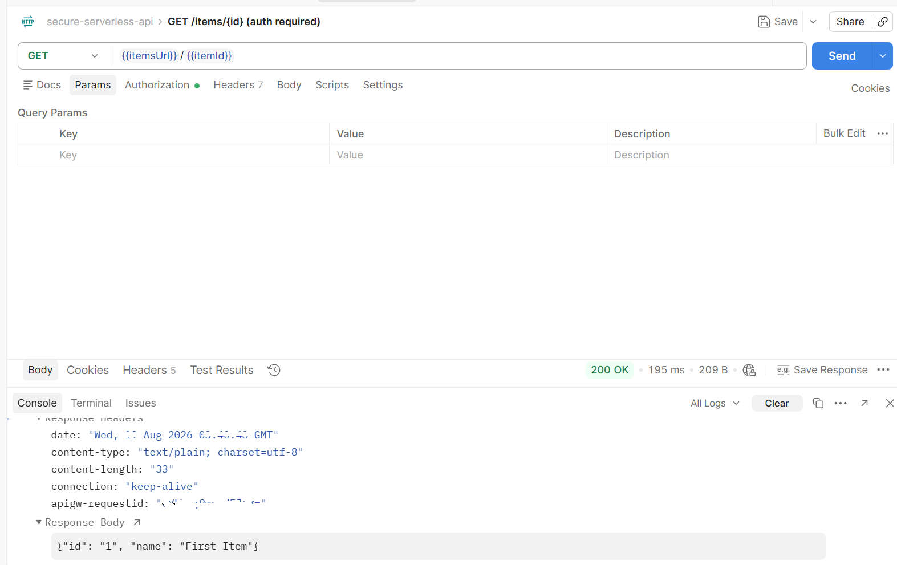
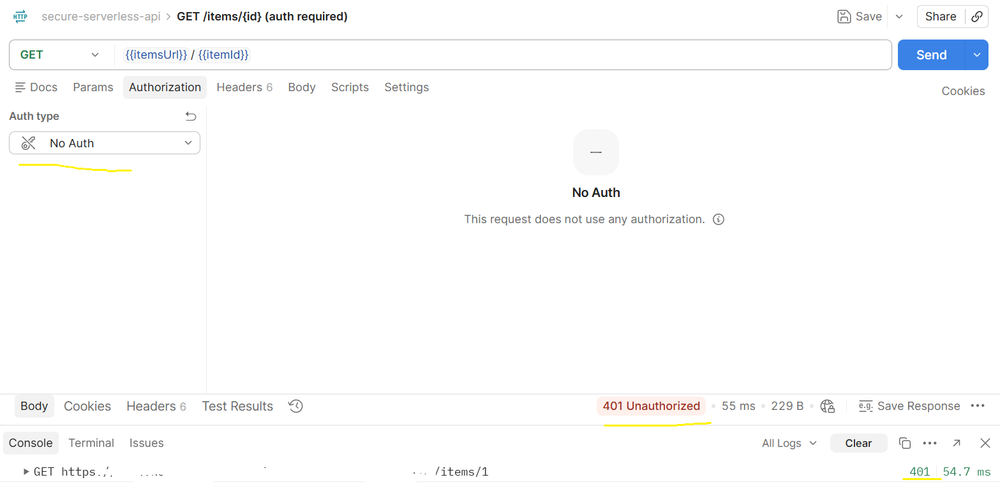
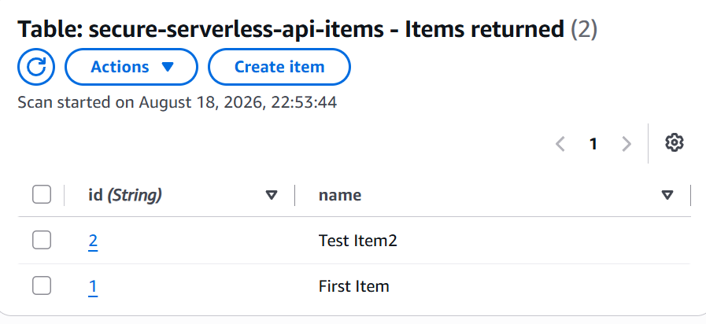
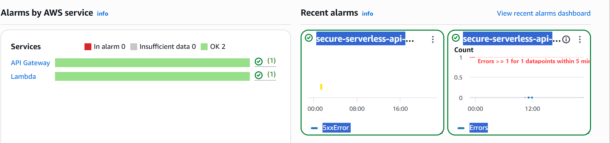

# Secure Serverless API

Infrastructure-as-code for a secure serverless API on AWS: API Gateway, Cognito,
Lambda, DynamoDB, IAM, CloudWatch, and API throttling.

## Architecture

## Security

- No AWS credentials are ever stored in this repo. Configure the AWS CLI locally
  with `aws configure` (or a named profile) — credentials live in `~/.aws/`,
  outside the project.
- Local-only secrets go in `.env` (git-ignored) — copy `.env.example` to get started.
- A pre-commit hook (`.githooks/pre-commit`) runs [gitleaks](https://github.com/gitleaks/gitleaks)
  on every commit and blocks it if a likely secret is detected. It's enabled
  automatically via `core.hooksPath` in this repo's git config.
- IAM roles/policies defined here follow least-privilege — no `AdministratorAccess`
  or wildcard `*` actions on production resources.

## Status

`template.yaml` defines a working stack: Lambda + HTTP API Gateway (`GET /hello`
public, `POST /items` / `GET /items/{id}` backed by DynamoDB), Cognito
authentication on the `/items` routes, stage-level API throttling, and CloudWatch
alarms (Lambda errors, API 5xx) notifying an SNS topic. Manually tested end to
end — see [TESTING.md](TESTING.md) for what was verified and how.

**WAF is intentionally not included.** The HTTP API type used here doesn't
support direct WAF attachment (only REST API, CloudFront, ALB, AppSync, and
Cognito do) - fronting it with CloudFront or migrating to REST API is a
reasonable follow-up, planned as a separate project rather than a rework here.

## Screenshots

**`GET /hello` — public route, no auth required**

**`POST /items` — creating an item (Cognito-authenticated)**

**`GET /items/{id}` — reading an item back (Cognito-authenticated)**

**`GET /items/{id}` without a token — auth is actually enforced**

**DynamoDB — the item as stored**

**CloudWatch alarms — Lambda errors and API 5xx, both configured**

